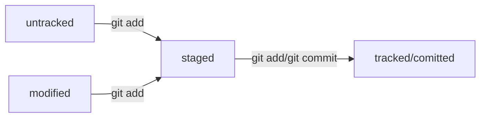

# Помощник для работы с Git

1. Инициализация репозитория с помощью команды `git init` (не забудьте сначала перейти в директорию репозитория с помощью `cd`).
(Если вы сделали ошибочный репозиторий, то можно его *разгитить* `rm -rf .git`).
2. Проверить статус `git status`.
3. Добавить файлы в репозиторий `git add --all` (все файлы в репозитории) или `git add .` (вся текущая папка) или `git add README.md` (конкретный файл).
4. Делаем коммит `git commit -m 'Мой первый коммит!'`.
5. Просматриваем историю коммитов `git log`.
6. Заходим на GitHub, создаем новый репозиторий, копируем HTTPS или SSH код репозитория. 
7. Привязываем удаленный репозиторий к удаленному, последним параметром вставляем код репозитория `git remote add origin git@github.com:%ИМЯ_АККАУНТА%/first-project.git`.
8. Убедиться, что репозитории связаны `git remote -v`.
9. Отправить изменения на удалённый репозиторий `git push`. В первый раз эту команду нужно вызвать с флагом -u 
и параметрами origin (имя удалённого репозитория) и main или master (название текущей ветки).
Флаг -u свяжет локальную ветку с одноимённой удалённой. Вот так: `git push -u origin master`.

**При последующих изменениях репозитория каждый раз повторять 3 (*add*), 4 (*commit*) и 9 (*push*) пункты.**

Бывает, что изменения не *"пушатся"* (например, когда вы решили изменить последний коммит), для этого можно использовать `git push -f`.
---

---
* Также, если вы хотите изменить **последний** коммит, вы можете использовать:
** `git commit --amend --no-edit` (если сообщение **последнего** коммита оставить без изменений);
** `git commit --amend -m "Новое сообщение"` (если вы хотите изменить сообщение **последнего** коммита);

Чтобы убрать лишний файл из *staging* (т.е. вы не хотите добавлять файл в коммит) поможет команда `git restore --staged <file>`. 
Тогда файл уйдет из списка на *commit* и станет *untracked*.

«Откатить» изменения, которые не попали ни в *staging*, ни в *коммит*, — `git restore <file>`.
Может быть так, что вы случайно изменили файл, который не планировали. 
Теперь он отображается в *Changes not staged for commit (modified)*. 
Команда `git restore <file>` «откатит» изменения в файле до последней сохранённой (в *коммите* или в *staging*) версии.

«Откатить» коммит — `git reset --hard <commit hash>`. Тогда последующие коммиты будут удалены (те, что идут после коммита, на который мы откатились).
---

## Статусы файлов в Git

* **untracked**(неотслеживаемый) - Git видит, что такой файл существует, но не следит за изменениями в нем, у него нет предыдущих версий,
 зафиксированных в коммитах или через команду `git add`.
* **staged**(подготовленный) - после выполнения `git add` файл попадает в *staging area*, т.е. в список файлов, которые войдут в коммит.
* **tracked**(отслеживаемый) - в него попадают файлы, которые уже были зафиксированы с помощью `git commit`, 
а также которые добавлены в *staging area* командой `git add`. Т.е. файлы, в которых Git так или иначе отслеживает изменения.
* **modified**(измененный) - Git сравнил содержимое файла с последней сохранённой версией и нашёл отличия.

*Для файлов в состояниях staged и modified обычно не указывают, что они также tracked, потому что это состояние подразумевается.*

### Про **staged** и **modified**

Команда `git add` добавляет в *staging area* только текущее содержимое файла. Например, если вы сделаете `git add file.txt`, а затем измените `file.txt`, то новое содержимое
не будет находиться в *staging area*. Git сообщит об этом с помощью статуса *modified*: файл изменён относительно той версии, которая уже в *staging*. 
Чтобы добавить в *staging* последнюю версию, нужно выполнить `git add file.txt` ещё раз.
* Файл может быть одновременно в `staged` и `modified`. (если файл уже добавили в список на коммит через `git add`, а после этого изменили.)
* Файл может быть `tracked` и `staged`. (файл считается tracked, если он staged.)

## Схема статусов файлов

